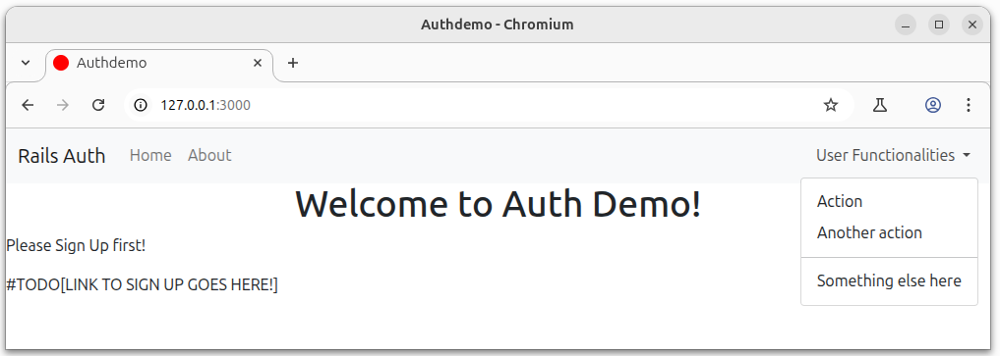
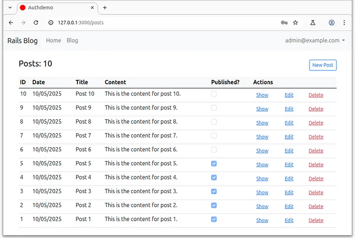

# Project Devise + Pundit

### Work With Devise & Pundit

#### Secure & Scale Your Rails App with Devise and Pundit 

Welcome to the **#DevisePunditSeries** - Episode 0!

This step-by-step tutorial will guide you through building a simple Rails 8 application to test Pundit and Devise.

In this initial version, we'll set up a starter app featuring a Bootstrap 5 navbar with basic Dashboard and About pages.

A dropdown menu labeled User Functionalities is included, ready for future session-based features.

Let’s get started!

## Roadmap

- [0 - Episode](https://medium.com/jungletronics/infra-upload-initial-rails-8-app-with-devise-pundit-f328a4632f5e) - Initial Rails 8 app with Devise & Pundit
- [1 - Episode](https://medium.com/jungletronics/mastering-pundit-episode-1-bc841bf0c698) -Mastering Pundit - A Beginner’s Guide to Understanding Pundit and Its Authorization Flow
- [2 - Episode](https://medium.com/jungletronics/work-with-devise-pundit-38799fd506d9) - Secure & Scale Your Rails App with Devise and Pundit — #DevisePunditSeries

- soon ...

## Screenshots
Episode 0

Episode 3

## Authors

- [@jaythree](https://www.linkedin.com/in/giljrx/)

## License

[MIT](https://choosealicense.com/licenses/mit/)

